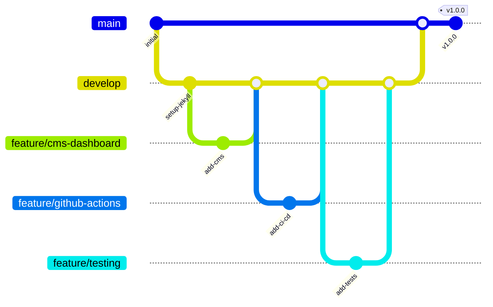

# Blog CMS Platform

A Jekyll-based blog platform with a React CMS dashboard for content management.

## Architecture



## Features

- Jekyll-based static blog
- React CMS dashboard
- Firebase hosting
- Automated GitHub Actions workflows
- Docker containerization

## Development

### Prerequisites

- Ruby >= 2.7.0
- Node.js >= 14
- Docker (optional)

### Setup

1. Clone the repository
2. Install Jekyll dependencies:
   ```bash
   bundle install
   ```
3. Install CMS dashboard dependencies:
   ```bash
   cd cms-dashboard
   npm install
   ```

### Running locally

1. Start Jekyll server:
   ```bash
   bundle exec jekyll serve
   ```
2. Start CMS dashboard:
   ```bash
   cd cms-dashboard
   npm start
   ```

### Docker

```bash
docker-compose up
```

## Testing

```bash
npm test
```

## Deployment

The site is automatically deployed to Firebase hosting when changes are pushed to the main branch.
